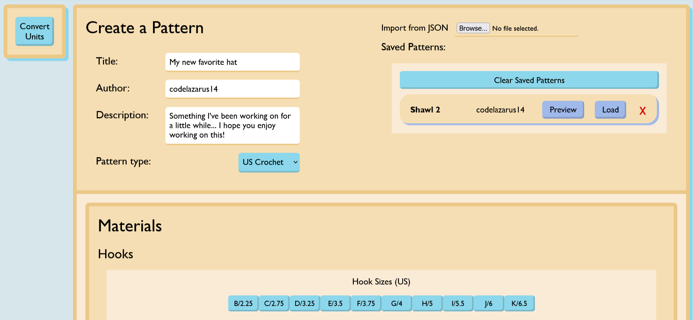

A website for creating, exporting and using crochet patterns. 

# Use

To see more about how to use the website's features, check out the <b>How To</b> section in the site header.

From the site's home page (the generator), a pattern requires that the user enter some basic information to identify the pattern. After selecting which type of pattern to use, the page should expand to display a complete form for creating a pattern. 

Once all the details have been filled in and any other requirements are satisfied, the pattern is ready to save and use at any point. Submitting a new pattern will open a preview that displays the pattern in its output format, ready to be exported as either a raw JSON or PDF. 

A pattern can also be added to the website by editing the contents of an existing pattern and resubmitting it, or uploading a JSON exported from the preview page.

To use a pattern and track your progress, the <b>Use A Pattern</b> page allows you to choose from the list of saved patterns on the website to be displayed in an interactive format. Using the arrow keys or entering numbers into the Row and Section fields allows you to select different active steps in the pattern, which will be saved periodically. The pattern will also show annotations in-line for certain terms defined in the pattern materials and glossary sections.

# Pattern Structure

Every pattern makes use of basic identifying information such as a title, author and an optional description.

A US Crochet pattern is further divided into:
- Materials (such as yarns and hooks of different sizes)
- Glossary (an optional list of specific terms or abbreviations)
- Notes (an optional section to add more information about the pattern)
- Steps

The Steps section is further divided into Rows and optional Sections
- Section # (defines a region of the pattern with its own row count)
- Row N, M (the instructions to be followed for all rows between N and M, inclusive)

If there is only one section in the pattern (the default), no section headings will be displayed.

# Extras

The sidebar also includes a unit converting tool, which allows you to easily convert between common types of units. The website also allows 'Skeins' to be used as a measure of yarn length, which requires the user to further approximate the length of a skein in another unit.

All user-uploaded images can be clicked on to see a high resolution preview.